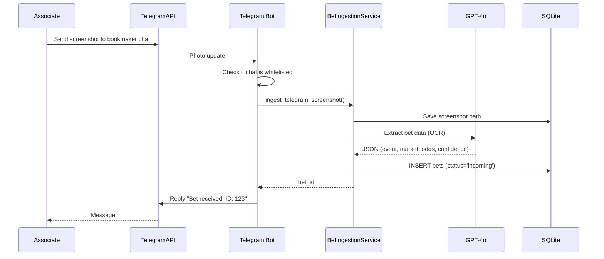
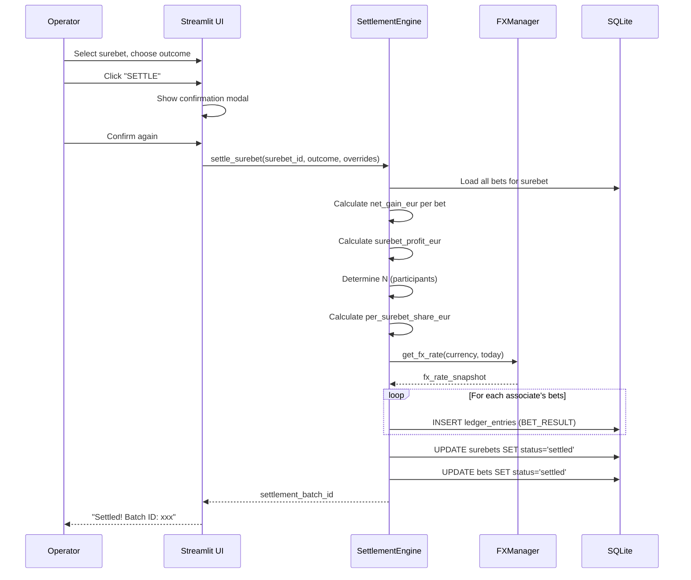
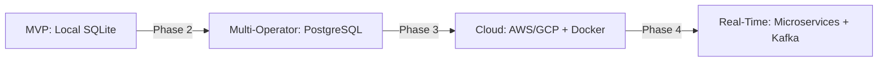

# System Architecture: Surebet Accounting System

**Version:** v4
**Status:** Draft
**Last Updated:** 2025-10-29
**Owner:** Winston (Architect)
**Related Documents:** [PRD v4](prd.md)

---

## Sharded Architecture Documents

This architecture document is organized into focused, detailed sub-documents:

### Core Architecture
- **[Technology Stack](architecture/tech-stack.md)** - Programming languages, frameworks, libraries, and tools
- **[Frontend Architecture](architecture/frontend-architecture.md)** - Streamlit UI design, pages, and components
- **[Backend Architecture](architecture/backend-architecture.md)** - Service layer, business logic, and core components
- **[Data Architecture](architecture/data-architecture.md)** - Database schema, SQLite configuration, and query patterns

### Integration & Operations
- **[Integration Architecture](architecture/integration-architecture.md)** - Telegram Bot, OpenAI GPT-4o, and FX Rate APIs
- **[Deployment Architecture](architecture/deployment-architecture.md)** - Local setup, production deployment, and backup strategies
- **[Security Architecture](architecture/security-architecture.md)** - Threat model, API key management, and data protection

### Development & Quality
- **[Testing Strategy](architecture/testing-strategy.md)** - Unit, integration, and E2E testing approaches
- **[Data Flows](architecture/data-flows.md)** - Sequence diagrams and data flow patterns
- **[Coding Standards](architecture/coding-standards.md)** - Code style, conventions, and best practices
- **[Source Tree](architecture/source-tree.md)** - Directory structure and file organization

---

## Table of Contents

1. [Executive Summary](#executive-summary)
2. [Architecture Principles](#architecture-principles)
3. [System Overview](#system-overview)
4. [Technology Stack](#technology-stack)
5. [Frontend Architecture](#frontend-architecture)
6. [Backend Architecture](#backend-architecture)
7. [Data Architecture](#data-architecture)
8. [Integration Architecture](#integration-architecture)
9. [Security Architecture](#security-architecture)
10. [Deployment Architecture](#deployment-architecture)
11. [Data Flow & Sequence Diagrams](#data-flow--sequence-diagrams)
12. [Component Details](#component-details)
13. [Testing Strategy](#testing-strategy)
14. [Monitoring & Observability](#monitoring--observability)
15. [Performance Considerations](#performance-considerations)
16. [Error Handling & Resilience](#error-handling--resilience)
17. [Future Evolution & Scalability](#future-evolution--scalability)

---

## Executive Summary

The Surebet Accounting System is a **local-first, single-operator desktop application** built to replace manual spreadsheet-based arbitrage betting operations. The architecture prioritizes:

- **Simplicity**: Single-machine deployment with no distributed systems complexity
- **Data Integrity**: Append-only ledger with frozen FX snapshots for immutable financial records
- **Offline-First**: All critical operations work without internet (except Telegram/OCR)
- **Determinism**: Reproducible calculations and audit trails
- **Human-in-the-Loop**: No silent automation, operator approval required

### Architecture at a Glance

```
┌─────────────────────────────────────────────────────────────┐
│               SINGLE ACCOUNTANT MACHINE                      │
│  ┌────────────────────┐         ┌────────────────────────┐  │
│  │   Streamlit UI     │◄───────►│   Core Python Backend  │  │
│  │  (localhost:8501)  │         │   - Business Logic     │  │
│  │                    │         │   - Settlement Engine  │  │
│  └────────────────────┘         │   - FX Manager         │  │
│           ▲                     └──────────┬─────────────┘  │
│           │                                │                │
│           ▼                                ▼                │
│  ┌────────────────────┐         ┌────────────────────────┐  │
│  │  Telegram Bot      │         │   SQLite Database      │  │
│  │  (Polling Mode)    │         │   (WAL Mode)           │  │
│  │                    │         │   data/surebet.db      │  │
│  └─────────┬──────────┘         └────────────────────────┘  │
│            │                                                 │
└────────────┼─────────────────────────────────────────────────┘
             │
             ▼
    ┌────────────────────┐
    │  External Services  │
    │  - Telegram API     │
    │  - OpenAI GPT-4o    │
    │  - FX Rate API      │
    └────────────────────┘
```

---

## Architecture Principles

### 1. Local-First, No Cloud Dependency
- All data stored locally in SQLite
- No remote database connections
- No authentication/authorization layers needed
- Works offline (except Telegram/OCR)

### 2. Append-Only Financial Ledger
- Immutable history (System Law #1)
- All corrections are forward adjustments
- Every ledger entry stores frozen FX snapshot
- Complete audit trail from day one

### 3. Deterministic & Reproducible
- Settlement calculations must produce identical results on re-run
- No hidden randomness or timestamps in business logic
- All FX conversions use frozen `fx_rate_snapshot` from creation time

### 4. Human-in-the-Loop
- No silent automation
- Operator approves every bet before matching
- Operator confirms every settlement
- No automatic messaging to associates

### 5. Simplicity Over Scalability
- Single operator, single machine
- No distributed systems
- No microservices
- No containers (MVP)
- Monolithic Python application

### 6. Data Integrity First
- SQLite in WAL mode for crash resistance
- Foreign key constraints enforced
- CHECK constraints for enum validation
- Regular CSV exports as backup

---

## System Overview

### Deployment Model

**Deployment Type**: Local Desktop Application
**Target Platform**: Single Windows/Mac/Linux machine
**Operator Count**: 1 (solo operator)
**Concurrency**: Single-threaded UI, background Telegram polling

### Core Components

| Component | Technology | Purpose |
|-----------|------------|---------|
| **UI Frontend** | Streamlit | Interactive web UI at localhost:8501 |
| **Business Logic** | Python 3.12 | Core domain logic, settlement engine |
| **Database** | SQLite (WAL) | Local persistent storage |
| **Telegram Bot** | python-telegram-bot v20+ | Screenshot ingestion, coverage proof delivery |
| **OCR/AI Pipeline** | OpenAI GPT-4o | Bet extraction from screenshots |
| **FX Manager** | Python service | Currency conversion caching |

### External Dependencies

| Service | Purpose | Fallback Strategy |
|---------|---------|-------------------|
| **Telegram API** | Bot communication | Queue messages for retry |
| **OpenAI API** | OCR + normalization | Queue bets in "incoming" status |
| **FX Rate API** | EUR conversion rates | Use last known rate from `fx_rates_daily` |

---

## Technology Stack

### Programming Languages & Frameworks

| Layer | Technology | Version | Justification |
|-------|------------|---------|---------------|
| **Backend** | Python | 3.12+ | Rich ecosystem, decimal precision, rapid development |
| **UI Framework** | Streamlit | 1.30+ | Fast prototyping, built-in widgets, no frontend boilerplate |
| **Database** | SQLite | 3.40+ | Zero-config, ACID guarantees, WAL mode for resilience |
| **Bot Framework** | python-telegram-bot | 20.0+ | Async support, polling mode, rich API |

### Key Libraries

```python
# Core Dependencies
streamlit>=1.30.0          # UI framework
python-telegram-bot>=20.0  # Telegram integration
openai>=1.0.0             # GPT-4o API
sqlite3                   # Built-in Python stdlib
decimal                   # Currency math (no floats!)

# Supporting Libraries
pandas>=2.1.0             # CSV export, data manipulation
pillow>=10.0.0            # Image handling
python-dotenv>=1.0.0      # Environment config
httpx>=0.25.0             # Async HTTP client
structlog>=23.0.0         # Structured logging
```

### Development Tools

| Tool | Purpose |
|------|---------|
| **pytest** | Unit/integration testing |
| **black** | Code formatting |
| **mypy** | Static type checking |
| **ruff** | Linting |
| **pre-commit** | Git hooks for quality gates |

---

## Frontend Architecture

### Streamlit Application Structure

```
src/ui/
├── app.py                      # Main entry point, page router
├── pages/
│   ├── 1_incoming_bets.py      # FR-1, FR-2: Ingestion & review
│   ├── 2_surebets.py           # FR-3, FR-4, FR-5: Matching & coverage
│   ├── 3_settlement.py         # FR-6, FR-7: Settlement & corrections
│   ├── 4_reconciliation.py     # FR-8: Health check, funding events
│   ├── 5_export.py             # FR-9: Ledger CSV export
│   └── 6_statements.py         # FR-10: Monthly partner reports
├── components/
│   ├── bet_card.py             # Reusable bet display component
│   ├── surebet_table.py        # Surebet summary table
│   ├── settlement_preview.py   # Settlement calculation preview
│   └── reconciliation_card.py  # Per-associate summary card
└── utils/
    ├── formatters.py           # EUR formatting, date display
    ├── validators.py           # Input validation helpers
    └── state_management.py     # Streamlit session state helpers
```

### Page Design Philosophy

**Single-Page-Per-Workflow**: Each functional requirement maps to one Streamlit page
**Stateless Widgets**: Streamlit reruns on every interaction, minimize session state
**Direct DB Queries**: No ORM complexity, direct SQLite queries via `sqlite3`

### UI Component Patterns

#### 1. Incoming Bets Page (FR-1, FR-2)

```python
# Pseudo-code structure
def render_incoming_bets_page():
    st.title("Incoming Bets")

    # Section 1: Manual Upload Panel
    with st.expander("📤 Upload Manual Bet"):
        screenshot = st.file_uploader("Screenshot", type=["png", "jpg"])
        associate_id = st.selectbox("Associate", options=load_associates())
        bookmaker_id = st.selectbox("Bookmaker", options=load_bookmakers(associate_id))
        if st.button("Import & OCR"):
            handle_manual_upload(screenshot, associate_id, bookmaker_id)

    # Section 2: Incoming Queue
    incoming_bets = load_incoming_bets()  # status='incoming'
    for bet in incoming_bets:
        render_bet_card(bet, editable=True, actions=["Approve", "Reject"])

    # Counters
    st.metric("Waiting Review", count_status("incoming"))
    st.metric("Approved Today", count_approved_today())
```

#### 2. Settlement Page (FR-6)

```python
def render_settlement_page():
    st.title("Settlement")

    # Filter: Show only unsettled surebets, sorted by kickoff
    surebets = load_unsettled_surebets_sorted_by_kickoff()

    selected_surebet_id = st.selectbox("Select Surebet", surebets)

    if selected_surebet_id:
        surebet = load_surebet_with_bets(selected_surebet_id)

        # Display bets
        st.subheader("Side A")
        for bet in surebet.side_a:
            render_bet_card(bet, show_screenshot=True)

        st.subheader("Side B")
        for bet in surebet.side_b:
            render_bet_card(bet, show_screenshot=True)

        # Outcome selection
        base_outcome = st.radio("Outcome", ["Side A WON", "Side B WON"])

        # Individual overrides
        for bet in surebet.all_bets:
            bet.override = st.selectbox(f"Override {bet.id}", ["AUTO", "WON", "LOST", "VOID"])

        # Preview settlement
        preview = calculate_settlement_preview(surebet, base_outcome, overrides)
        render_settlement_preview(preview)

        # Confirm with modal
        if st.button("⚠️ SETTLE (Permanent)", type="primary"):
            if st.session_state.get("confirm_modal"):
                settle_surebet(surebet, base_outcome, overrides)
                st.success("Settled!")
                st.rerun()
            else:
                st.session_state.confirm_modal = True
                st.warning("Click again to confirm. This action is PERMANENT.")
```

### State Management Strategy

**Minimize Session State**: Only use for:
- Active surebet selection
- Inline edit buffers
- Confirmation modals

**Prefer Database as Truth**: Always query fresh data on page load
**No In-Memory Caching**: Streamlit reruns are cheap, SQLite reads are fast

---

## Backend Architecture

### Service Layer Architecture

```
src/
├── core/
│   ├── config.py               # Environment config, API keys
│   ├── database.py             # SQLite connection manager
│   └── types.py                # Shared type definitions (Decimal, enums)
├── services/
│   ├── bet_ingestion.py        # FR-1: OCR pipeline, bet creation
│   ├── bet_verification.py     # FR-2: Approval workflow, audit log
│   ├── surebet_matcher.py      # FR-3: Deterministic matching logic
│   ├── surebet_calculator.py   # FR-4: ROI calculation
│   ├── coverage_service.py     # FR-5: Coverage proof distribution
│   ├── settlement_engine.py    # FR-6: Core settlement math
│   ├── ledger_service.py       # Ledger entry creation, queries
│   ├── fx_manager.py           # FX rate caching, conversions
│   └── reconciliation.py       # FR-8: Health check calculations
├── integrations/
│   ├── telegram_bot.py         # Telegram polling loop, handlers
│   ├── openai_client.py        # GPT-4o OCR + normalization
│   └── fx_api_client.py        # External FX rate fetching
├── models/
│   ├── bet.py                  # Bet domain model
│   ├── surebet.py              # Surebet domain model
│   ├── ledger_entry.py         # Ledger entry domain model
│   └── enums.py                # BetStatus, SettlementState, etc.
└── utils/
    ├── decimal_helpers.py      # Decimal arithmetic utilities
    ├── datetime_helpers.py     # UTC ISO8601 formatting
    └── logging_config.py       # Structured logging setup
```

### Core Service Descriptions

#### 1. Bet Ingestion Service (FR-1)

**Responsibility**: Transform screenshots into structured bet records

```python
# src/services/bet_ingestion.py
class BetIngestionService:
    def ingest_telegram_screenshot(
        self,
        screenshot_path: str,
        associate_id: int,
        bookmaker_id: int,
        telegram_message_id: int
    ) -> int:
        """
        1. Save screenshot to data/screenshots/
        2. Call OpenAI GPT-4o for OCR + normalization
        3. Create bets row with status='incoming'
        4. Return bet_id
        """

    def ingest_manual_screenshot(
        self,
        screenshot_bytes: bytes,
        associate_id: int,
        bookmaker_id: int,
        note: Optional[str] = None
    ) -> int:
        """
        Same as Telegram path, but ingestion_source='manual_upload'
        """
```

**Key Logic**:
- Screenshot saved with unique filename: `{timestamp}_{associate_id}_{bookmaker_id}.png`
- GPT-4o prompt includes:
  - Market normalization examples
  - Confidence scoring instructions
  - Multi-leg detection rules
- All Decimal values stored as TEXT in SQLite

#### 2. Surebet Matcher (FR-3)

**Responsibility**: Deterministically group opposite bets into surebets

```python
# src/services/surebet_matcher.py
class SurebetMatcher:
    def attempt_match(self, bet_id: int) -> Optional[int]:
        """
        After bet verified, check for opposing bets:
        1. Query verified bets with same canonical_event_id, market_code, period_scope, line_value
        2. Find logical opposite side (OVER vs UNDER, YES vs NO, TEAM_A vs TEAM_B)
        3. If match found:
           - Create/update surebets row
           - Insert surebet_bets links with side='A' or side='B'
           - Update bet status to 'matched'
        4. Return surebet_id or None
        """

    def determine_side(self, side_enum: BetSide) -> Literal["A", "B"]:
        """
        Deterministic side assignment:
        - A: OVER, YES, TEAM_A
        - B: UNDER, NO, TEAM_B

        THIS MAPPING NEVER CHANGES AFTER INITIAL ASSIGNMENT
        """
```

**Critical Constraint**: Once a bet is assigned to side A or B via `surebet_bets.side`, that value is immutable. Settlement logic depends on this stability.

#### 3. Settlement Engine (FR-6)

**Responsibility**: Calculate equal-split settlements and write ledger entries

```python
# src/services/settlement_engine.py
class SettlementEngine:
    def settle_surebet(
        self,
        surebet_id: int,
        base_outcome: Literal["A_WON", "B_WON"],
        overrides: Dict[int, SettlementState],  # bet_id -> WON/LOST/VOID
        operator_note: str
    ) -> str:
        """
        1. Load all bets for surebet
        2. Apply base outcome + individual overrides
        3. For each bet, calculate:
           - net_gain_eur = (payout_eur - stake_eur) if WON else (-stake_eur if LOST else 0)
        4. Calculate surebet_profit_eur = sum(all net_gain_eur)
        5. Determine N (participant count):
           - If admin staked: N = len(unique associates who placed bets)
           - If admin did NOT stake: N = len(unique associates) + 1
        6. Calculate per_surebet_share_eur = surebet_profit_eur / N
        7. For each associate's bets:
           - principal_returned_eur = sum(stake_eur for WON/VOID bets)
           - Create ledger_entries row:
             - type='BET_RESULT'
             - settlement_state (WON/LOST/VOID)
             - amount_eur = net_gain_eur
             - principal_returned_eur
             - per_surebet_share_eur
             - fx_rate_snapshot (from FX cache at settlement time)
             - settlement_batch_id (shared UUID for this settlement)
        8. Mark surebet.status='settled', bets.status='settled'
        9. Return settlement_batch_id
        """
```

**Settlement Math Reference** (from PRD):
- **WON**: `net_gain_eur = payout_eur - stake_eur`, `principal_returned_eur = stake_eur`
- **LOST**: `net_gain_eur = -stake_eur`, `principal_returned_eur = 0`
- **VOID**: `net_gain_eur = 0`, `principal_returned_eur = stake_eur`
- **Admin Seat**: If admin did NOT stake, they get exactly one extra seat in the split AND eat losses equally

#### 4. FX Manager

**Responsibility**: Cache FX rates and provide frozen snapshots

```python
# src/services/fx_manager.py
class FXManager:
    def get_fx_rate(
        self,
        currency: str,
        target_date: date
    ) -> Decimal:
        """
        1. Check fx_rates_daily table for currency + target_date
        2. If found, return cached_rate
        3. If not found:
           - Fetch from external API
           - Cache in fx_rates_daily
           - Return rate
        4. If API fails, return last known rate for currency
        """

    def convert_to_eur(
        self,
        amount_native: Decimal,
        currency: str,
        fx_rate_snapshot: Decimal
    ) -> Decimal:
        """
        Simple conversion: amount_native * fx_rate_snapshot

        NEVER query current FX rate for old transactions!
        Always use frozen snapshot.
        """
```

**FX Caching Strategy**:
- One rate per currency per day (midnight UTC cutoff)
- Reuse last known rate if API unavailable
- All ledger entries store `fx_rate_snapshot` used at creation time

---

## Data Architecture

### Database Technology: SQLite (WAL Mode)

**Why SQLite?**
- Zero configuration
- ACID guarantees with WAL mode
- Excellent for single-user, local-first apps
- 140 TB theoretical limit (far beyond MVP needs)
- Built-in foreign key support

**Configuration**:
```python
# src/core/database.py
def init_db(db_path: str = "data/surebet.db"):
    conn = sqlite3.connect(db_path, check_same_thread=False)
    conn.execute("PRAGMA foreign_keys = ON")
    conn.execute("PRAGMA journal_mode = WAL")
    conn.execute("PRAGMA synchronous = NORMAL")
    return conn
```

### Schema Design Principles

1. **Explicit Enums via CHECK Constraints**: No magic strings
2. **Decimal as TEXT**: All currency values stored as TEXT to preserve precision
3. **UTC Timestamps**: All `*_utc` columns store ISO8601 with "Z" suffix
4. **Foreign Keys Enforced**: Cascading deletes where appropriate
5. **Composite Indexes**: Optimized for common queries (status filters, date ranges)

### Core Tables

See [Data Model Document](docs/prd/data-model.md) for complete schema. Key tables:

| Table | Rows (Est.) | Indexes | Purpose |
|-------|-------------|---------|---------|
| `associates` | <20 | PK | Trusted partners |
| `bookmakers` | <100 | PK, FK | Accounts per associate |
| `canonical_events` | ~1000/month | PK, date index | Normalized events |
| `bets` | ~500/month | PK, FK, status index | Individual bets |
| `surebets` | ~200/month | PK, status index | Grouped opposite bets |
| `surebet_bets` | ~500/month | PK, FK | Junction table |
| `ledger_entries` | ~600/month | PK, FK, type index, date index | Financial ledger |
| `fx_rates_daily` | ~30/month | PK (currency, date) | FX cache |

### Ledger Table Design (Critical)

```sql
CREATE TABLE ledger_entries (
    id INTEGER PRIMARY KEY AUTOINCREMENT,

    -- Type: BET_RESULT, DEPOSIT, WITHDRAWAL, BOOKMAKER_CORRECTION
    type TEXT NOT NULL CHECK (type IN ('BET_RESULT', 'DEPOSIT', 'WITHDRAWAL', 'BOOKMAKER_CORRECTION')),

    -- Who and where
    associate_id INTEGER NOT NULL REFERENCES associates(id),
    bookmaker_id INTEGER REFERENCES bookmakers(id),  -- NULL for DEPOSIT/WITHDRAWAL

    -- Native currency amounts
    amount_native TEXT NOT NULL,  -- Decimal as TEXT
    native_currency TEXT NOT NULL,

    -- EUR conversion (frozen at creation time)
    fx_rate_snapshot TEXT NOT NULL,  -- Decimal: EUR per 1 unit native
    amount_eur TEXT NOT NULL,        -- Decimal: amount_native * fx_rate_snapshot

    -- BET_RESULT specific fields
    settlement_state TEXT CHECK (settlement_state IN ('WON', 'LOST', 'VOID') OR settlement_state IS NULL),
    principal_returned_eur TEXT,     -- Decimal: stake returned if WON/VOID
    per_surebet_share_eur TEXT,      -- Decimal: equal-split seat
    surebet_id INTEGER REFERENCES surebets(id),
    bet_id INTEGER REFERENCES bets(id),
    settlement_batch_id TEXT,        -- UUID linking all rows from one settlement

    -- Audit trail
    created_at_utc TEXT NOT NULL DEFAULT (strftime('%Y-%m-%dT%H:%M:%fZ', 'now')),
    created_by TEXT NOT NULL DEFAULT 'local_user',
    note TEXT,

    -- Indexes
    INDEX idx_ledger_associate (associate_id),
    INDEX idx_ledger_type (type),
    INDEX idx_ledger_date (created_at_utc)
);
```

**Key Ledger Invariants**:
- **Append-Only**: No UPDATE or DELETE after creation (System Law #1)
- **Frozen FX**: `fx_rate_snapshot` never recalculated (System Law #2)
- **Batch ID**: All ledger rows from one settlement share `settlement_batch_id`
- **VOID Rows**: Even all-VOID surebets write BET_RESULT rows with zeros

### Query Patterns

#### Reconciliation Queries (FR-8)

```sql
-- NET_DEPOSITS_EUR for associate
SELECT
    SUM(
        CASE
            WHEN type = 'DEPOSIT' THEN CAST(amount_eur AS REAL)
            WHEN type = 'WITHDRAWAL' THEN -CAST(amount_eur AS REAL)
            ELSE 0
        END
    ) AS net_deposits_eur
FROM ledger_entries
WHERE associate_id = ?
AND type IN ('DEPOSIT', 'WITHDRAWAL');

-- SHOULD_HOLD_EUR (entitlement) for associate
SELECT
    SUM(
        CAST(principal_returned_eur AS REAL) +
        CAST(per_surebet_share_eur AS REAL)
    ) AS should_hold_eur
FROM ledger_entries
WHERE associate_id = ?
AND type = 'BET_RESULT';

-- CURRENT_HOLDING_EUR for associate
SELECT
    SUM(CAST(amount_eur AS REAL)) AS current_holding_eur
FROM ledger_entries
WHERE associate_id = ?;

-- DELTA = CURRENT_HOLDING_EUR - SHOULD_HOLD_EUR
```

---

## Integration Architecture

### 1. Telegram Bot Integration

**Library**: `python-telegram-bot` v20+
**Mode**: Polling (not webhook, to avoid exposing local machine)

#### Bot Architecture

```
src/integrations/telegram_bot.py
├── TelegramBotService
│   ├── start_polling()          # Main loop
│   ├── handle_photo()           # Screenshot ingestion
│   ├── handle_text()            # Deposit/withdrawal intent parsing
│   ├── send_coverage_proof()    # FR-5: Send screenshots to multibook chats
│   └── log_message()            # Log to multibook_message_log
```

#### Chat Configuration

```python
# Environment config: .env
TELEGRAM_BOT_TOKEN=xxx
TELEGRAM_ADMIN_CHAT_ID=yyy      # Where operator receives admin alerts

# Database: telegram_chats table
# - chat_id (Telegram ID)
# - chat_type: 'bookmaker' | 'multibook'
# - associate_id (FK)
# - bookmaker_id (FK, NULL for multibook)
```

#### Bot Handlers

```python
async def handle_photo(update: Update, context: ContextTypes.DEFAULT_TYPE):
    """
    1. Check if chat is a known bookmaker chat
    2. If yes:
       - Download photo
       - Extract associate_id, bookmaker_id from chat mapping
       - Call BetIngestionService.ingest_telegram_screenshot()
       - Reply: "Screenshot received! Bet ID: {bet_id}. Check Incoming Bets page."
    3. If no: Ignore (or warn if admin chat)
    """

async def send_coverage_proof(surebet_id: int):
    """
    FR-5: Coverage Proof Distribution
    1. Load surebet with all bets
    2. For each associate on Side A:
       - Get their multibook chat_id
       - Send all Side B screenshots with caption
       - Log to multibook_message_log
    3. Repeat for Side B associates (send Side A screenshots)
    """
```

**Error Handling**:
- Telegram API failures: Retry 3x with exponential backoff, then queue for manual retry
- Unknown chats: Log warning, do not create bet
- Rate limits: Respect Telegram limits (30 messages/second), add delays

### 2. OpenAI GPT-4o Integration

**Library**: `openai` Python SDK v1.0+
**Model**: `gpt-4o` (multimodal, supports image input)

#### OCR + Normalization Pipeline

```python
# src/integrations/openai_client.py
class OpenAIClient:
    def extract_bet_from_screenshot(
        self,
        screenshot_path: str
    ) -> Dict[str, Any]:
        """
        1. Encode screenshot as base64
        2. Send to GPT-4o with prompt:
           - Extract: event, market, period, line, side, stake, odds, payout, currency, kickoff_time
           - Normalize event name to canonical form
           - Normalize market to market_code enum
           - Detect multi-leg bets (set is_multi=True)
           - Return confidence score (0.0-1.0)
        3. Parse response (expect JSON)
        4. Return structured dict
        """
```

**Prompt Template** (abridged):
```
You are a bet slip OCR system. Extract the following from this screenshot:
- canonical_event: Normalize team/event names (e.g., "Man Utd" → "Manchester United")
- market_code: Map to one of: TOTAL_GOALS_OVER_UNDER, ASIAN_HANDICAP, BOTH_TEAMS_TO_SCORE_YES_NO, etc.
- period_scope: FULL_MATCH, FIRST_HALF, etc.
- line_value: Decimal (e.g., 2.5 for Over/Under 2.5)
- side: OVER, UNDER, YES, NO, TEAM_A, TEAM_B
- stake: Decimal
- odds: Decimal
- payout: Decimal (potential return if won)
- currency: ISO code (AUD, GBP, EUR, etc.)
- kickoff_time_utc: ISO8601 guess
- is_multi: Boolean (true if accumulator/parlay)
- normalization_confidence: 0.0-1.0 (0.8+ = high confidence)

Return JSON only.
```

**Confidence Scoring**:
- ≥0.8: High confidence (✅ badge)
- <0.8: Low confidence (⚠ badge, requires extra review)

**Fallback**:
- If GPT-4o API fails, create bet with status='incoming', confidence=0.0, note="OCR failed, manual entry required"

### 3. FX Rate API Integration

**Provider Options**: Exchangerate-API, Fixer.io, or ECB (European Central Bank)
**Frequency**: Daily (midnight UTC)

#### FX API Client

```python
# src/integrations/fx_api_client.py
class FXAPIClient:
    def fetch_daily_rates(self, base_currency: str = "EUR") -> Dict[str, Decimal]:
        """
        1. Call external API for latest rates
        2. Return {currency: rate} dict (e.g., {"AUD": 1.65, "GBP": 0.85})
        3. Cache in fx_rates_daily table
        """
```

**Caching Strategy**:
- One row per (currency, date) in `fx_rates_daily`
- FXManager checks cache first, only fetches if missing
- If API unavailable, use last known rate with warning log

---

## Security Architecture

### Threat Model

**Deployment Context**: Local machine, single operator, no remote access
**Trust Boundary**: Operator's machine is trusted, external APIs are NOT

### Security Considerations

#### 1. API Key Management

```python
# .env (not committed to git)
TELEGRAM_BOT_TOKEN=xxx
OPENAI_API_KEY=xxx
FX_API_KEY=xxx

# .gitignore
.env
data/
```

**Best Practice**: Use `python-dotenv` to load from `.env`, never hardcode

#### 2. Data Protection

- **No encryption at rest** (MVP): SQLite file is unencrypted (operator's machine is trusted)
- **Future Enhancement**: Encrypt `data/` directory with OS-level encryption (BitLocker, FileVault)

#### 3. Telegram Bot Security

- **Whitelist known chats**: Only accept photos from chats in `telegram_chats` table
- **No public commands**: Bot only responds to configured chats
- **Polling mode**: No webhook means no exposed ports

#### 4. Input Validation

- **SQL Injection**: Use parameterized queries (`?` placeholders)
- **Path Traversal**: Validate screenshot filenames, no `../` allowed
- **Decimal Overflow**: Use Python's `Decimal` with reasonable precision (28 digits)

---

## Deployment Architecture

### Local Development Setup

```bash
# 1. Clone repository
git clone <repo> && cd surebet-accounting

# 2. Create virtual environment
python3.12 -m venv venv
source venv/bin/activate  # or venv\Scripts\activate on Windows

# 3. Install dependencies
pip install -r requirements.txt

# 4. Configure environment
cp .env.example .env
# Edit .env with API keys

# 5. Initialize database
python -m src.core.database init

# 6. Start Telegram bot (background)
python -m src.integrations.telegram_bot &

# 7. Start Streamlit UI (foreground)
streamlit run src/ui/app.py
```

### Production Deployment (Single Machine)

```
Accountant Machine
├── OS: Windows 10/11 or macOS
├── Python 3.12+ installed
├── Application: c:\surebet-accounting\ (or ~/surebet-accounting/)
├── Data: c:\surebet-accounting\data\
│   ├── surebet.db             # SQLite database
│   ├── screenshots/            # Bet screenshots
│   └── exports/                # CSV exports
├── Logs: data/logs/
│   ├── telegram_bot.log
│   ├── settlement.log
│   └── application.log
└── Processes:
    ├── Streamlit UI: http://localhost:8501
    └── Telegram Bot: Background polling
```

**Process Management** (MVP):
- Manual start: Run Streamlit and Telegram bot in separate terminals
- **Future**: Use `systemd` (Linux) or Windows Service for auto-start

### Backup Strategy

1. **Daily Automatic CSV Export**: Cron job to export ledger to `data/exports/ledger_backup_YYYY-MM-DD.csv`
2. **Manual SQLite Backup**: Operator copies `data/surebet.db` to external drive weekly
3. **Screenshot Backup**: `data/screenshots/` backed up to cloud storage (Dropbox, OneDrive)

---

## Data Flow & Sequence Diagrams

### Sequence 1: Telegram Screenshot Ingestion (FR-1)



### Sequence 2: Settlement & Ledger Creation (FR-6)



### Data Flow: Reconciliation Calculation (FR-8)

```
┌─────────────────────────────────────────────────────────┐
│                    ledger_entries                        │
│  (All financial history for associate)                   │
└──────────────────┬──────────────────────────────────────┘
                   │
                   ├──► Filter: type IN ('DEPOSIT', 'WITHDRAWAL')
                   │    └──► SUM(amount_eur) = NET_DEPOSITS_EUR
                   │
                   ├──► Filter: type = 'BET_RESULT'
                   │    └──► SUM(principal_returned_eur + per_surebet_share_eur)
                   │         = SHOULD_HOLD_EUR
                   │
                   └──► All types
                        └──► SUM(amount_eur) = CURRENT_HOLDING_EUR

DELTA = CURRENT_HOLDING_EUR - SHOULD_HOLD_EUR

If DELTA > 0: "Holding €X more than entitlement (group float)"
If DELTA ≈ 0: "Balanced ✅"
If DELTA < 0: "Short €X (someone else holding your money)"
```

---

## Component Details

### Component 1: Surebet Calculator (FR-4)

**Purpose**: Calculate worst-case profit and ROI for open surebets

```python
# src/services/surebet_calculator.py
class SurebetCalculator:
    def calculate_roi(self, surebet_id: int) -> Dict[str, Decimal]:
        """
        1. Load all bets for surebet
        2. Convert all stakes to EUR using cached FX
        3. Calculate potential profit if Side A wins:
           profit_if_A = sum(Side A payouts) - total_staked
        4. Calculate potential profit if Side B wins:
           profit_if_B = sum(Side B payouts) - total_staked
        5. worst_case_profit_eur = min(profit_if_A, profit_if_B)
        6. roi = worst_case_profit_eur / total_staked_eur
        7. Classify:
           - ✅ if worst_case >= 0 and roi >= 0.02 (2% threshold)
           - 🟡 if worst_case >= 0 and roi < 0.02
           - ❌ if worst_case < 0
        8. Return {worst_case_profit_eur, total_staked_eur, roi, label}
        """
```

**Classification Logic**:
- **Green (✅)**: Profitable with acceptable ROI (default 2%+)
- **Yellow (🟡)**: Technically profitable but low ROI (warning: not worth risk)
- **Red (❌)**: Negative expected profit (DO NOT SETTLE, likely data error)

### Component 2: Coverage Proof Service (FR-5)

**Purpose**: Manually send coverage proof screenshots to associates

```python
# src/services/coverage_service.py
class CoverageProofService:
    def send_coverage_proof(self, surebet_id: int):
        """
        1. Load surebet with all bets and screenshots
        2. Group bets by side (A vs B)
        3. For each associate on Side A:
           - Get their multibook chat_id from telegram_chats
           - Collect all Side B screenshot paths
           - Call TelegramBotService.send_media_group()
           - Caption: "Coverage proof for {event} {market}. You're covered!"
           - Log to multibook_message_log
        4. Repeat for Side B associates (send Side A screenshots)
        5. No screenshot anonymization (trust model: associates are friends)
        """
```

**Logging**:
```sql
INSERT INTO multibook_message_log (
    surebet_id,
    associate_id,
    telegram_message_id,
    screenshots_sent,
    sent_at_utc
) VALUES (?, ?, ?, ?, ?);
```

---

## Testing Strategy

### Testing Pyramid

```
              /\
             /  \    E2E Tests (5%)
            /----\   - Full workflow: Telegram → Settlement → Export
           /      \
          /--------\ Integration Tests (25%)
         /          \ - Service layer + DB
        /            \
       /--------------\ Unit Tests (70%)
      /                \ - Pure functions, calculators, validators
     /------------------\
```

### Unit Tests

**Target**: 80%+ coverage on business logic

```python
# tests/unit/test_settlement_engine.py
def test_equal_split_with_admin_seat():
    """
    Given: Surebet with 2 associates betting, admin did NOT stake
    When: Settlement calculated
    Then: N = 3 (2 associates + 1 admin seat)
    """

def test_void_participates_in_split():
    """
    Given: Surebet with 1 WON, 1 VOID
    When: Settlement calculated
    Then: Both associates get equal share of profit, VOID has net_gain_eur=0
    """

def test_frozen_fx_snapshot():
    """
    Given: Ledger entry with fx_rate_snapshot=1.50
    When: Current FX rate changes to 1.60
    Then: EUR conversion still uses 1.50 (immutable)
    """
```

### Integration Tests

```python
# tests/integration/test_bet_ingestion_flow.py
def test_telegram_screenshot_to_incoming_queue(test_db, mock_telegram, mock_openai):
    """
    Given: Telegram bot receives screenshot
    When: Bot processes photo
    Then: Bet created in DB with status='incoming', OCR data populated
    """
```

### E2E Tests

```python
# tests/e2e/test_full_surebet_lifecycle.py
def test_end_to_end_surebet_settlement(test_db, test_screenshots):
    """
    1. Ingest 2 opposing bets (manual upload)
    2. Verify both bets
    3. Assert surebet created with status='open'
    4. Settle surebet with outcome='A_WON'
    5. Assert ledger entries created
    6. Assert reconciliation shows correct DELTA
    7. Export ledger CSV and validate contents
    """
```

### Test Data Strategy

- **Fixtures**: Seed database with test associates, bookmakers, canonical events
- **Mock APIs**: Use `pytest-mock` for Telegram, OpenAI, FX APIs
- **Deterministic Timestamps**: Freeze time in tests with `freezegun`

---

## Monitoring & Observability

### Logging Strategy

**Library**: `structlog` for structured JSON logs

```python
# src/utils/logging_config.py
import structlog

structlog.configure(
    processors=[
        structlog.stdlib.add_log_level,
        structlog.processors.TimeStamper(fmt="iso"),
        structlog.processors.JSONRenderer()
    ]
)

logger = structlog.get_logger()
```

**Log Levels**:
- **DEBUG**: Detailed flow (e.g., "Querying bets with status=incoming")
- **INFO**: Key events (e.g., "Bet 123 verified", "Surebet 45 settled")
- **WARNING**: Recoverable issues (e.g., "FX API unavailable, using cached rate")
- **ERROR**: Failures requiring attention (e.g., "Telegram send failed after 3 retries")

**Log Files**:
```
data/logs/
├── application.log      # All application logs
├── telegram_bot.log     # Telegram-specific logs
└── settlement.log       # Settlement & ledger operations
```

### Metrics (MVP: Manual Monitoring)

**Daily Operator Checklist**:
1. Check "Reconciliation / Health Check" page for DeltA anomalies
2. Review `application.log` for ERROR entries
3. Verify Telegram bot is polling (check last message timestamp)
4. Export ledger CSV (backup)

**Future Enhancement**: Add Prometheus/Grafana for dashboards

---

## Performance Considerations

### Expected Load (MVP)

| Metric | Estimate |
|--------|----------|
| Associates | 5-10 |
| Bets/month | 200-500 |
| Surebets/month | 100-200 |
| Ledger entries/month | 300-600 |
| Concurrent users | 1 (operator only) |

**Conclusion**: Performance is NOT a bottleneck for MVP. SQLite handles this scale trivially.

### Query Optimization

- **Indexes**: Created on foreign keys, status columns, date columns
- **Query Complexity**: All queries are simple SELECTs/JOINs (no nested subqueries)
- **Caching**: FX rates cached daily, no need for in-memory cache

### Streamlit Performance

- **Page Load Time**: Target <1 second for all pages
- **Strategy**: Minimize session state, prefer direct DB queries
- **Pagination**: Not needed for MVP (hundreds of records, not thousands)

---

## Error Handling & Resilience

### Error Categories

| Category | Example | Handling Strategy |
|----------|---------|-------------------|
| **Transient** | Telegram API timeout | Retry 3x with exponential backoff |
| **Permanent** | Invalid bet data | Mark bet as `status='rejected'`, log error |
| **User Error** | Operator selects wrong outcome | Confirm modal, BOOKMAKER_CORRECTION if needed |
| **System Error** | SQLite DB locked | Retry with delay, alert operator if persists |

### Graceful Degradation

- **Telegram Offline**: Queue screenshots for processing when bot reconnects
- **OpenAI Offline**: Create bets with confidence=0.0, manual entry required
- **FX API Offline**: Use last known rate, log warning

### Append-Only Ledger Recovery

**Scenario**: Operator realizes settlement error after 1 week

**Solution**: Create forward-only correction
```python
# Never reopen old surebets, never delete ledger rows
ledger_service.create_correction(
    associate_id=5,
    bookmaker_id=12,
    amount_native=Decimal("-50.00"),  # Negative = debit
    currency="AUD",
    note="Correction for late VOID on Surebet 45"
)
```

**Audit Trail**: Correction appears in ledger with timestamp, note explains why

---

## Future Evolution & Scalability

### Phase 2: Multi-Operator Support

**Changes Required**:
- Add `users` table with login/password
- Add `user_id` FK to ledger_entries, surebets
- Implement RBAC: "admin" vs "read-only"
- Migrate from Streamlit to proper web framework (Flask/FastAPI + React)

### Phase 3: Cloud Deployment

**Changes Required**:
- Replace SQLite with PostgreSQL (multi-user support)
- Deploy backend as Docker container
- Add Redis for session management
- Use webhook mode for Telegram bot (no polling)

### Phase 4: Real-Time Surebet Detection

**Changes Required**:
- Integrate with bookmaker odds APIs
- Add `opportunities` table for auto-detected surebets
- Push notifications to associates via Telegram
- High-frequency FX updates (minute-level)

**Architectural Impact**: Shift from "local-first" to "cloud-first" paradigm

---

## Appendices

### Appendix A: Environment Variables

```bash
# .env file
TELEGRAM_BOT_TOKEN=123456:ABC-DEF1234ghIkl-zyx57W2v1u123ew11
TELEGRAM_ADMIN_CHAT_ID=987654321
OPENAI_API_KEY=sk-proj-xxx
FX_API_KEY=xxx
DB_PATH=data/surebet.db
SCREENSHOT_DIR=data/screenshots
EXPORT_DIR=data/exports
LOG_LEVEL=INFO
```

### Appendix B: File Structure

```
surebet-accounting/
├── .env                        # Environment config (not committed)
├── .gitignore
├── requirements.txt
├── README.md
├── docs/
│   ├── prd.md                  # Product requirements
│   ├── architecture.md         # This document
│   └── settlement-math.md      # Settlement formulas
├── data/                       # Git-ignored
│   ├── surebet.db              # SQLite database
│   ├── screenshots/            # Bet screenshots
│   ├── exports/                # CSV exports
│   └── logs/                   # Application logs
├── src/
│   ├── core/
│   │   ├── config.py
│   │   ├── database.py
│   │   └── types.py
│   ├── services/
│   │   ├── bet_ingestion.py
│   │   ├── bet_verification.py
│   │   ├── surebet_matcher.py
│   │   ├── surebet_calculator.py
│   │   ├── coverage_service.py
│   │   ├── settlement_engine.py
│   │   ├── ledger_service.py
│   │   ├── fx_manager.py
│   │   └── reconciliation.py
│   ├── integrations/
│   │   ├── telegram_bot.py
│   │   ├── openai_client.py
│   │   └── fx_api_client.py
│   ├── models/
│   │   ├── bet.py
│   │   ├── surebet.py
│   │   ├── ledger_entry.py
│   │   └── enums.py
│   ├── ui/
│   │   ├── app.py
│   │   ├── pages/
│   │   │   ├── 1_incoming_bets.py
│   │   │   ├── 2_surebets.py
│   │   │   ├── 3_settlement.py
│   │   │   ├── 4_reconciliation.py
│   │   │   ├── 5_export.py
│   │   │   └── 6_statements.py
│   │   ├── components/
│   │   │   ├── bet_card.py
│   │   │   ├── surebet_table.py
│   │   │   ├── settlement_preview.py
│   │   │   └── reconciliation_card.py
│   │   └── utils/
│   │       ├── formatters.py
│   │       ├── validators.py
│   │       └── state_management.py
│   └── utils/
│       ├── decimal_helpers.py
│       ├── datetime_helpers.py
│       └── logging_config.py
└── tests/
    ├── unit/
    ├── integration/
    └── e2e/
```

### Appendix C: Key Design Decisions & Rationale

| Decision | Rationale |
|----------|-----------|
| **SQLite over PostgreSQL** | No need for multi-user concurrency, zero-config simplicity |
| **Streamlit over FastAPI+React** | MVP speed, no frontend boilerplate, built-in widgets |
| **Polling over Webhook** | No exposed ports on local machine, simpler setup |
| **Decimal as TEXT** | Preserve exact precision, avoid float rounding errors |
| **Append-Only Ledger** | Immutable audit trail, no data loss, forward-only corrections |
| **Frozen FX Snapshots** | Deterministic calculations, no revaluation surprises |
| **Manual Settlement** | Operator must verify results, no auto-grading trust issues |
| **No RBAC** | Single operator, no need for authentication/authorization |

### Appendix D: Migration Path (If Future Cloud Deployment)



**MVP → Cloud Migration Checklist**:
1. Export all SQLite data to CSV
2. Create PostgreSQL schema (identical structure)
3. Import CSV to PostgreSQL
4. Update connection strings in `src/core/database.py`
5. Add authentication layer (JWT tokens)
6. Deploy backend as FastAPI service
7. Replace Streamlit with React SPA
8. Set up Telegram webhook (instead of polling)

---

## Document Control

**Version History**:

| Version | Date | Author | Changes |
|---------|------|--------|---------|
| v4 | 2025-10-29 | Winston (Architect) | Initial full-stack architecture based on PRD v4 |

**Approvals**:

| Role | Name | Date | Signature |
|------|------|------|-----------|
| Tech Lead | TBD | - | - |
| Product Owner | TBD | - | - |
| DevOps Lead | TBD | - | - |

---

**End of Document**
