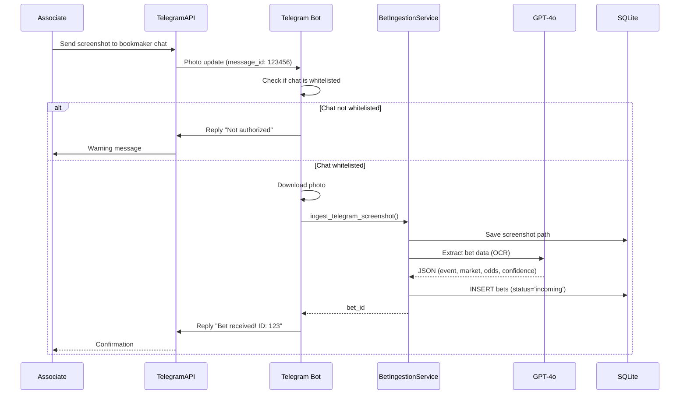
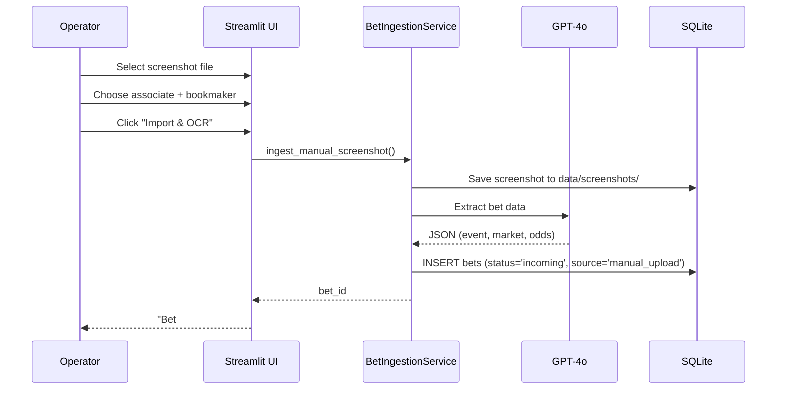
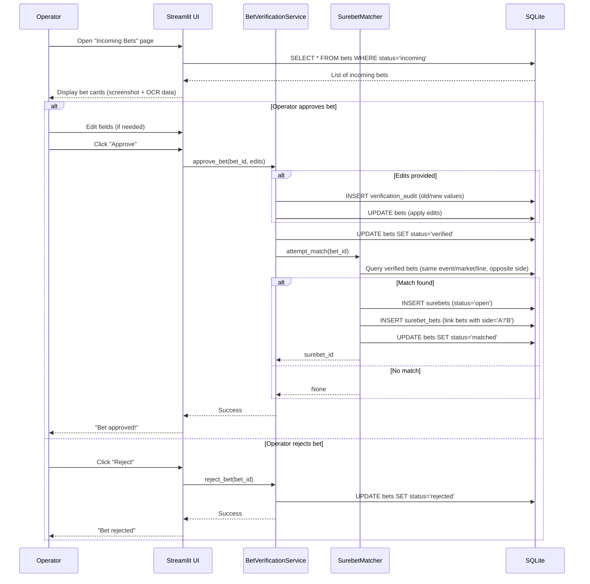
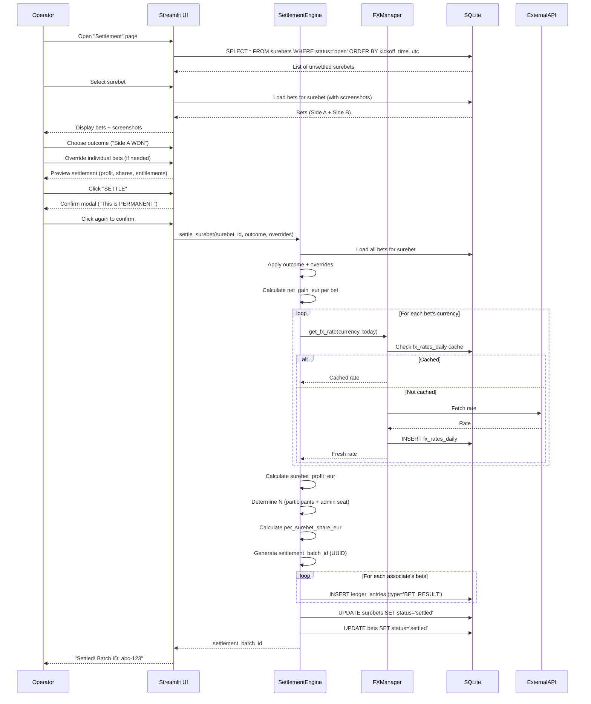
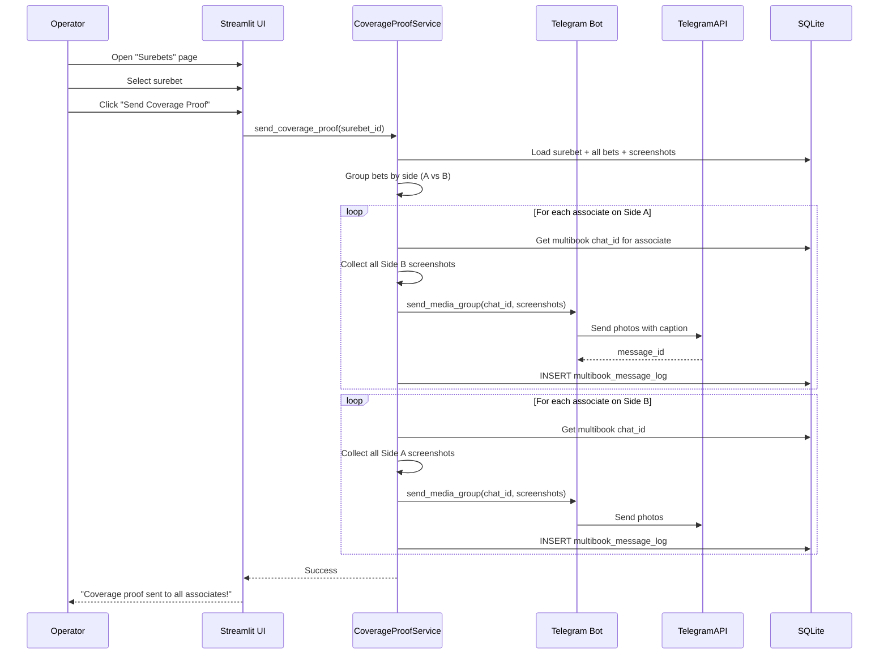
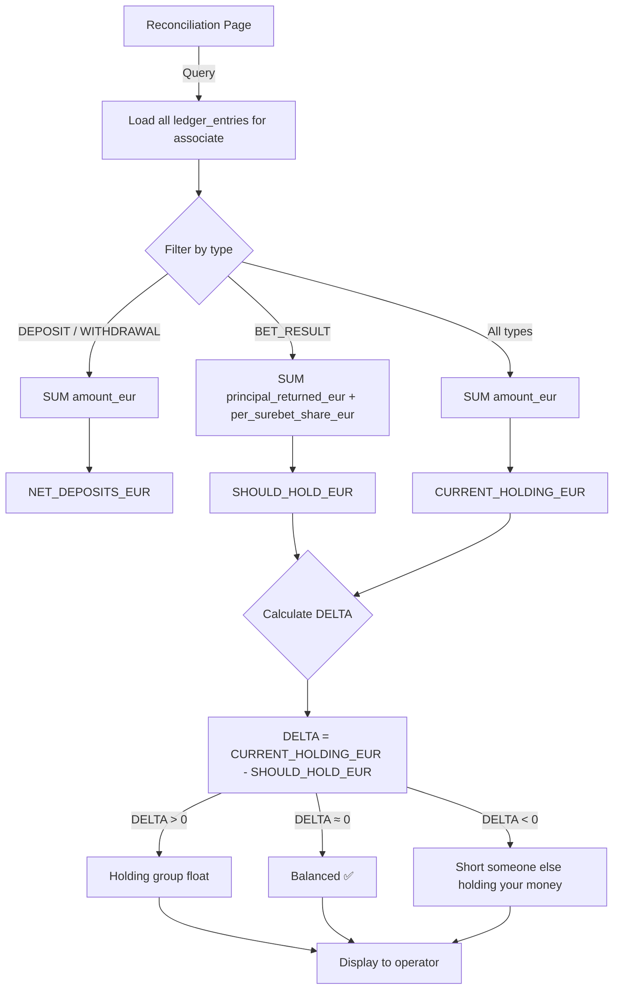
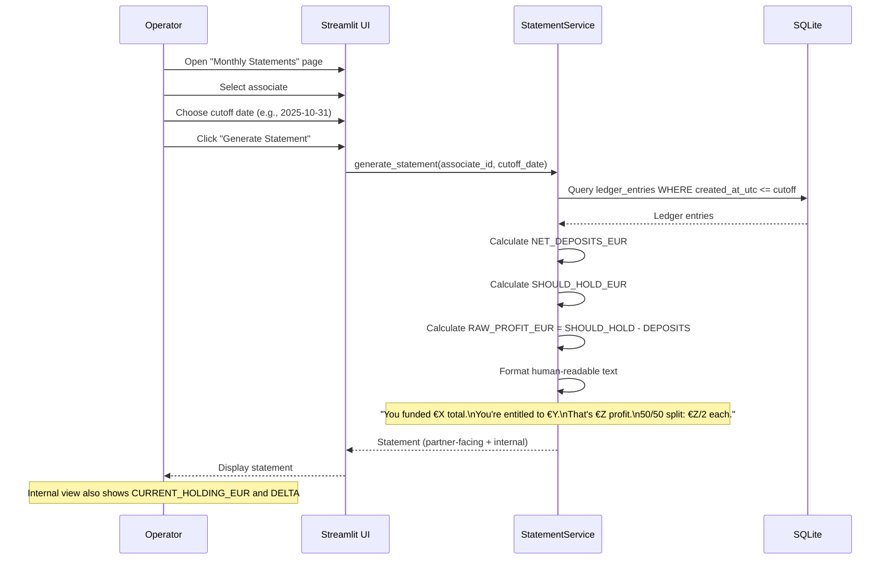
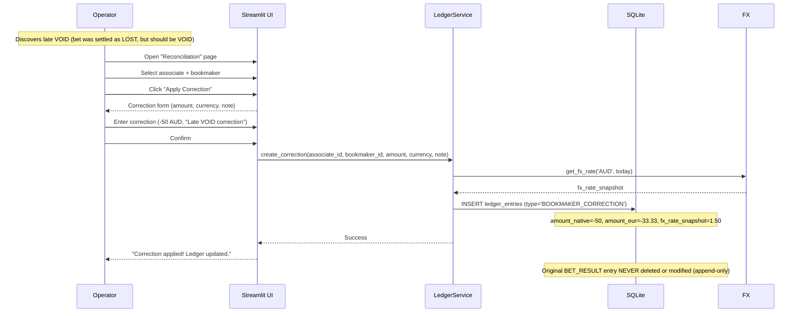

# Data Flows & Sequence Diagrams

**Version:** v4
**Last Updated:** 2025-10-29
**Parent Document:** [Architecture Overview](../architecture.md)

---

## Overview

This document illustrates key data flows through the system using sequence diagrams and flow charts.

---

## Flow 1: Telegram Screenshot Ingestion (FR-1)



**Key Points:**
- Bot whitelists chats to prevent unauthorized ingestion
- OCR runs immediately (async)
- If OCR fails, bet created with `confidence=0.0`

---

## Flow 2: Manual Screenshot Upload (FR-1.2)



**Difference from Telegram Flow:**
- `ingestion_source='manual_upload'`
- `telegram_message_id=NULL`
- Otherwise identical pipeline

---

## Flow 3: Bet Review & Approval (FR-2)



**Key Points:**
- All edits logged in `verification_audit`
- Matching attempted immediately after verification
- If no opposing bet found, bet remains `verified` (waits for match)

---

## Flow 4: Surebet Settlement (FR-6)



**Key Points:**
- Settlement creates **one ledger entry per associate** (not per bet, but grouped)
- All entries share `settlement_batch_id` for grouping
- FX rates frozen at settlement time (never recalculated)

---

## Flow 5: Coverage Proof Delivery (FR-5)



**Key Points:**
- Manual trigger only (no automatic messaging)
- Each associate receives opposite side's screenshots
- All sends logged in `multibook_message_log`

---

## Flow 6: Reconciliation Calculation (FR-8)



**SQL Queries:**

```sql
-- NET_DEPOSITS_EUR
SELECT SUM(
    CASE
        WHEN type = 'DEPOSIT' THEN CAST(amount_eur AS REAL)
        WHEN type = 'WITHDRAWAL' THEN -CAST(amount_eur AS REAL)
        ELSE 0
    END
) FROM ledger_entries WHERE associate_id = ?;

-- SHOULD_HOLD_EUR
SELECT SUM(
    CAST(principal_returned_eur AS REAL) + CAST(per_surebet_share_eur AS REAL)
) FROM ledger_entries WHERE associate_id = ? AND type = 'BET_RESULT';

-- CURRENT_HOLDING_EUR
SELECT SUM(CAST(amount_eur AS REAL))
FROM ledger_entries WHERE associate_id = ?;
```

---

## Flow 7: Monthly Statement Generation (FR-10)



**Important:** Statements are **presentation-only**, they do NOT:
- Create ledger entries
- Change entitlement math
- Trigger any database writes

---

## Flow 8: Append-Only Ledger Correction (FR-7)



**Key Principle:** Never reopen old surebets. All fixes are forward-only adjustments.

---

## Data Lifecycle Summary

```
┌─────────────────────────────────────────────────────────────┐
│ 1. INGESTION (Telegram or Manual)                           │
│    Screenshot → OCR → bets (status='incoming')              │
└────────────┬────────────────────────────────────────────────┘
             │
             ▼
┌─────────────────────────────────────────────────────────────┐
│ 2. VERIFICATION (Operator Approval)                         │
│    Operator edits → bets (status='verified')                │
│    → verification_audit logged                              │
└────────────┬────────────────────────────────────────────────┘
             │
             ▼
┌─────────────────────────────────────────────────────────────┐
│ 3. MATCHING (Automatic)                                     │
│    Opposite bet found → surebets (status='open')            │
│    → surebet_bets links created                             │
│    → bets (status='matched')                                │
└────────────┬────────────────────────────────────────────────┘
             │
             ▼
┌─────────────────────────────────────────────────────────────┐
│ 4. SETTLEMENT (Operator Confirms)                           │
│    Choose outcome → ledger_entries (type='BET_RESULT')      │
│    → surebets (status='settled')                            │
│    → bets (status='settled')                                │
└────────────┬────────────────────────────────────────────────┘
             │
             ▼
┌─────────────────────────────────────────────────────────────┐
│ 5. RECONCILIATION (Daily Health Check)                      │
│    Calculate DELTA per associate                            │
│    → Flag anomalies                                         │
│    → Apply corrections if needed                            │
└────────────┬────────────────────────────────────────────────┘
             │
             ▼
┌─────────────────────────────────────────────────────────────┐
│ 6. EXPORT (Backup & Audit)                                  │
│    Export ledger → CSV (data/exports/)                      │
│    Generate monthly statements                              │
└─────────────────────────────────────────────────────────────┘
```

---

**End of Document**
