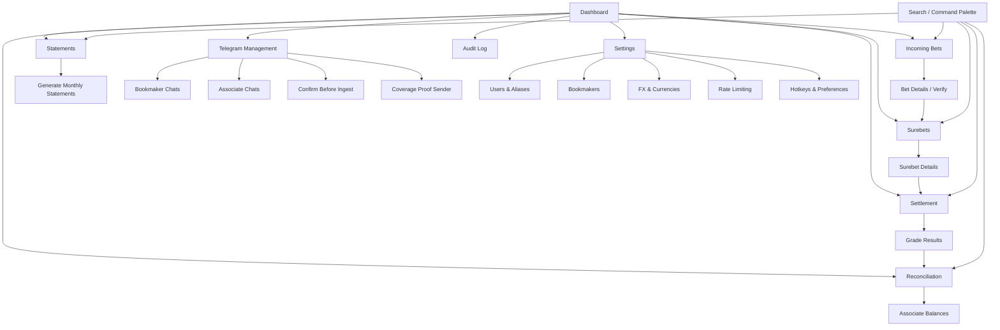

# Final_App UI/UX Specification

## Introduction
This document defines the user experience goals, information architecture, user flows, and visual design specifications for Final_App's user interface. It serves as the foundation for visual design and frontend development, ensuring a cohesive and user-centered experience.

### Overall UX Goals & Principles

#### Target User Personas
- Administrator (Operator)
  - Responsibilities: Review/approve incoming bets, correct OCR, match surebets, settle outcomes, reconcile balances, generate partner statements, manage Telegram confirmations.
  - Context: Solo operator, high-throughput triage, zero silent automation, strict audit trail, deterministic actions, keyboard-first bias.
  - Pain points: Screenshot chaos, manual reconciliation, error-prone edits, context switching, delayed confirmations, missing coverage proof, visual overload during peak windows.

#### Usability Goals
- Triage speed: Approve or fix an incoming bet in ≤10s median; bulk triage with minimal hand movement.
- Error prevention: Explicit confirmation for destructive/irreversible actions; preview of impact (affected surebets, ledger writes).
- Observability: Clear state badges (incoming/verified/rejected), confidence indicators, and audit trail visibility (last edit, who/when/what).
- Reduced context switching: Inline edit for core fields; quick-search for canonical events; keyboard shortcuts for approve/reject/edit.
- Consistency: Identical review experience for Telegram vs manual uploads; no silent approvals; consistent validation messaging.
- Quality of Life: Smart defaults (last used bookmaker/associate), sticky filters, saved views, “recent edits” sidebar.

#### Design Principles
1. Clarity over cleverness: Dense, legible data tables; emphasize signal over noise.
2. Progressive disclosure: Inline summary first; expandable advanced fields (market_code, period_scope, line_value).
3. Immediate feedback: Each action shows status toast + row state change + audit link.
4. Keyboard-first: Full review flow without mouse; mnemonic shortcuts surfaced in tooltips.
5. Accessible by default: AA contrast, visible focus states, live region updates for toasts; screen-reader-friendly table semantics.

#### Change Log
| Date       | Version | Description                     | Author           |
|------------|---------|---------------------------------|------------------|
| 2025-11-09 | 1.0     | Initial UX/UI specification     | Sally (UX Expert) |

## Information Architecture (IA)

### Site Map / Screen Inventory

### Navigation Structure
- Primary Navigation: Dashboard, Incoming Bets, Surebets, Settlement, Reconciliation, Statements, Telegram, Audit, Settings.
- Secondary Navigation:
  - Telegram: Bookmaker Chats, Associate Chats, Confirm Before Ingest, Coverage Proof.
  - Settings: Users & Aliases, Bookmakers, FX & Currencies, Rate Limiting, Hotkeys & Preferences.
  - Surebets: List, Surebet Details.
  - Reconciliation: Associate Balances, Bookmaker Balances.
- Breadcrumb Strategy: `Area > Subarea > Entity > Action` (e.g., `Surebets > #1234 > Legs`, `Settings > Telegram > Rate Limiting`, `Incoming Bets > Bet #A1B2C3 > Verify`).

## User Flows

### Telegram Confirm-Before-Ingest
- User sends photo → Bot replies with “Ingest”/“Discard” + stake prompt.
- User confirms via button or text (e.g., “#bet 50 win=200”).
- System marks pending → confirmed; stores overrides; moves to screenshots; triggers OCR.
- If no response in 60m → auto-discard; entry expires from pending.
- UI impact: “Incoming Bets” shows confirmed items; “Telegram > Confirm Before Ingest” lists active pendings with countdown, manual Discard/Force Ingest controls for admin emergencies.
- Message threading ties confirmation to specific photo; overrides persist to bet fields; no ingestion without explicit confirmation.

### Incoming Bet Review & Approval
- Open “Incoming Bets” (default filter: Today; source=All).
- Keyboard triage: Up/Down to move, E to edit fields inline, Enter to save, A to Approve, R to Reject.
- Confidence badge signals OCR reliability; tooltip reveals why.
- Approve → status=verified; downstream surebet matching runs; toast + audit link.
- Reject → status=rejected; optional note.
- QoL: Sticky filters; bulk actions (multi-select + Approve/Reject); quick search for event; last-used bookmaker/associate remembered.

### Surebet Matching + Coverage Proof
- “Surebets” shows matched pairs with ROI, worst-case EUR, status (Incomplete, Ready, Settled).
- Open details to inspect legs, normalization, and projected outcomes.
- “Send Coverage Proof” opens preview (text summary + leg screenshots).
- Admin clicks “Send” to post to multibook chat. No auto posts.
- Rate-limit indicator shows “Safe/At Risk/Queued”; queued sends execute when allowed.
- Safety: Dry-run preview; explicit Send required (No Silent Messaging).

### Settlement (Equal-Split with VOID participation)
- From surebet details, click “Grade Result”.
- Pick winner/VOID; UI computes EUR totals using frozen FX snapshots; shows seat splits incl. admin seat.
- Preview ledger rows (append-only); confirm → commit and show audit link.
- Guardrails: Destructive confirmation modal; VOID still appears in participants; no second skim.

### Reconciliation & Statements
- “Reconciliation” shows associate/bookmaker balances, overhold vs. short.
- Drill-in to associate ledger and recent settlements.
- “Statements” supports:
  - Daily Global Statement (Story 9.4): generate daily snapshot for operations.
  - Monthly Partner Statements: per-associate, human-readable; preview then download/share (manual send).
- QoL: One-click month selector; saved recipients; render to Markdown/PDF with consistent branding.

### Command Palette / Hotkeys
- “Cmd/Ctrl+K” opens palette to jump to screens/actions (Approve current, Open Surebet …).
- “?” opens shortcut overlay; tooltips show mnemonic hints.

## UI System & Components

### Design System Foundations
- Colors (AA): --bg, --surface, --text, --muted, --accent, --success, --warning, --error, --info. Light/dark themes; status colors map to state badges.
- Typography: Sans (Inter/Roboto), sizes 12/14/16 body; 20/24/32 headings; tabular lining numerals for odds/stakes.
- Spacing/grid: 4px scale; 12-col layout; compact/comfortable density toggle.
- Affordances: Minimal shadows; clear focus rings; visible interactive states.

### App Shell
- Left sidebar: Primary navigation.
- Top bar: Breadcrumbs, global search, command palette button, quick counters (Incoming/Verified Today).
- Command palette: Cmd/Ctrl+K to jump and run actions (Approve current, Open Surebet …).

### Data Table Pattern (Incoming Bets)
- Columns: Thumb, Associate, Bookmaker, Event (editable search), Market, Scope, Line, Side, Stake, Odds, Payout, Confidence, Source, Updated.
- Interactions: Inline cell edit, row select, bulk Approve/Reject, sticky header, virtualization for large queues.
- Keyboard: J/K (row), E (edit), Enter (save), A (approve), R (reject), / (search), Esc (cancel).
- States: Incoming/Verified/Rejected; unsaved-change indicator; confidence badges with tooltip rationale.

### Bet Verify Drawer
- Large screenshot, field editors with validation, OCR diff (original → normalized), audit preview (“will write …”).
- Actions: Save & Approve; Save only; Reject with note.

### Surebet Details
- Summary cards: ROI, worst-case EUR, legs, status.
- Legs table with normalization details; “Send Coverage Proof” preview (text + screenshots).
- Rate-limit indicator (Safe/Queued/Blocked) with tooltip.

### Settlement Modals
- Grade Result: winner/VOID; computed EUR totals using frozen FX; seat split (incl. admin seat); preview ledger rows; confirm with explicit warning.
- VOID handling shown; no second skim.

### Telegram Management
- Confirm Before Ingest: List pending photos with countdown, chat/message ID, preview; columns for parsed stake/win (if provided); actions: Discard; (policy-gated) Force Ingest with reason.
- Coverage Proof Queue: Outbox with statuses; per-item retry; respects rate limiting.
- Rate Limiting: Settings page for thresholds/queues; inline explanations and safe defaults.

### Notifications & Audit
- Toasts with ARIA live region; “View audit” link after commits.
- Audit Log: filter by entity/action; drill into change set.

### Forms & Inputs
- Numeric inputs with currency adorners; parse “win=” pattern; inline validation messages.
- Searchable selects for events/bookmakers; debounced queries; loading/empty states.

### Empty/Loading/Error States
- Empty: Friendly prompt + shortcut hint.
- Loading: Skeleton rows; stable layout.
- Error: Inline, retry affordance, log ref.

## Accessibility

### Key Requirements
**Visual**
- Color contrast ratios: AA (≥4.5:1) for text/badges.
- Focus indicators: 2px high-visibility focus rings.
- Text sizing: Respect user zoom; scalable rem-based sizes.

**Interaction**
- Keyboard navigation: Full tab order; skip to content; focus traps in modals.
- Screen reader support: Proper roles/labels; announce toasts via aria-live.
- Touch targets: ≥44px for interactive elements.

**Content**
- Alternative text: “Bet screenshot: {bookmaker}, {time}, id {short-id}”.
- Heading structure: Logical H1–H3 hierarchy.
- Form labels: Explicit labels and error helpers.

### Testing Strategy
- Automated: Axe/Lighthouse AA pass in critical views.
- Manual: Keyboard sweep; NVDA/VoiceOver spot checks on tables, drawers, modals.

## Responsiveness Strategy

### Breakpoints
| Breakpoint | Min Width | Max Width | Target Devices       |
|------------|-----------|-----------|----------------------|
| Mobile     | 0         | 599       | Phones               |
| Tablet     | 600       | 959       | Small tablets        |
| Desktop    | 960       | 1439      | Laptops/monitors     |
| Wide       | 1440      | -         | Large/wide monitors  |

### Adaptation Patterns
- Layout Changes: Sidebar collapses on ≤Tablet; drawer becomes full-screen; tables convert to stacked cards (Associate, Bookmaker, Event, Stake, Odds, Confidence prioritized).
- Navigation Changes: Top bar overflow menu on small screens; command palette via long‑press.
- Content Priority: Desktop-first density; mobile scoped to oversight actions.
- Interaction Changes: 44px targets; sticky triage action bar on small screens.

## Animation & Micro-interactions

### Motion Principles
- Subtle and purposeful; reinforce hierarchy and causality.
- Respect reduced-motion preference; provide non-animated fallbacks.
- Duration 150–250ms for UI transitions; easing: standard, decelerate on entry, accelerate on exit.

### Key Animations
- Approve/Reject row: brief background tint sweep (150ms) with toast; no layout shift.
- Drawer open/close: slide with fade (200ms), focus moves to first field.
- Button press: micro-scale (98%) with ripple/focus ring; accessible outline remains.

## Performance Considerations

### Performance Goals
- Page Load (Desktop): FCP ≤2s, TTI ≤3s.
- Interaction Response: ≤50ms perceived feedback for triage actions.
- Animation: 60 FPS on modern hardware.

### Design Strategies
- Virtualize large tables; memoize cells; debounce edits.
- Pre-generate thumbnails; lazy-load offscreen images; prefer WebP/AVIF; SWR caching.
- Batch safe updates; exponential backoff on 429s; surface queue state (Safe/Queued/Blocked).
- Route-level code splitting; defer non-critical scripts; cache vendor chunk.
- Observability: timers for triage actions, OCR trigger latency, coverage proof send time.

## Next Steps

### Immediate Actions
1. Finalize primary nav labels and whether “Audit” and “Statements” are top-level or nested.
2. Lock keyboard shortcut map + “?” help overlay; expose in tooltips.
3. Prototype “Incoming Bets” table with row virtualization and inline edit; capture baseline triage times.
4. Define “Confirm Before Ingest” admin view: countdown, message/thread IDs, Discard, policy-gated Force Ingest with reason.
5. Wire “Coverage Proof” outbox to Rate Limiting states (Safe/Queued/Blocked) from Story 9.5.
6. Establish thumbnail pipeline for screenshots (pre-generate, lazy-load); confirm storage paths and naming.
7. Run initial a11y sweep (Axe/Lighthouse) and manual keyboard traversal.
8. Agree mobile scope as oversight-only; restrict destructive actions to desktop with explicit confirm.

### Design Handoff Checklist
- All user flows documented
- Component inventory complete
- Accessibility requirements defined
- Responsive strategy clear
- Brand guidelines incorporated
- Performance goals established

### Open Questions
- Is “Force Ingest” allowed for admin emergencies? If yes, required justification and log level.
- Should “Statements” live under “Reconciliation” or remain top-level?
- Default currency adorners per bookmaker vs per associate; confirm mapping rules.
- Where to surface OCR confidence rationale (tooltip vs drawer section) for fastest triage?

## Checklist Results
Pending.

